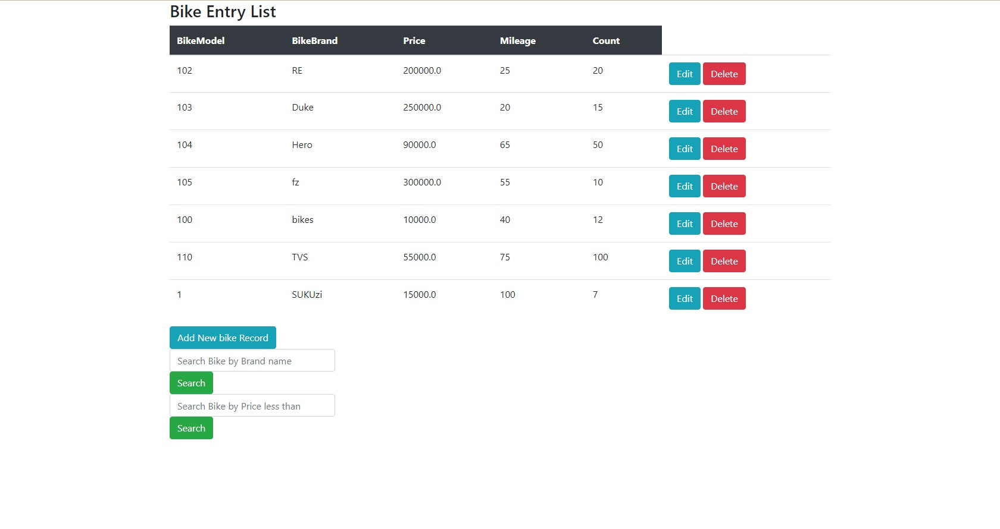
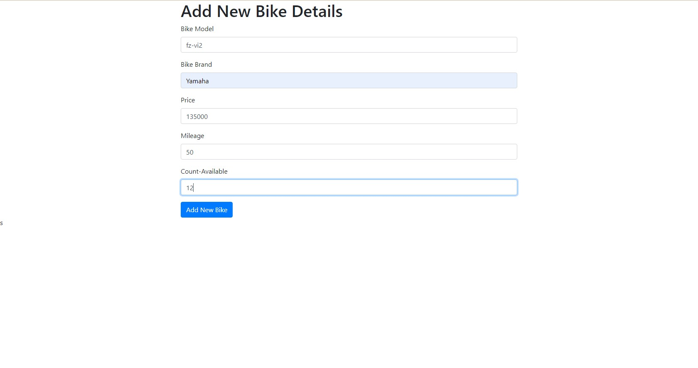
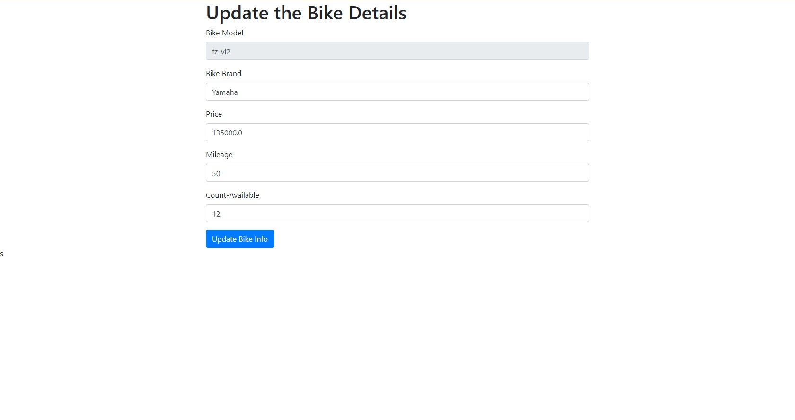
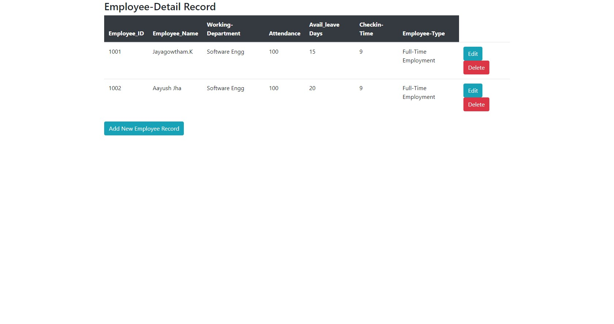
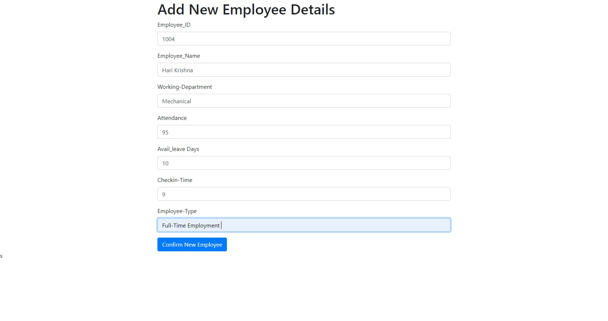
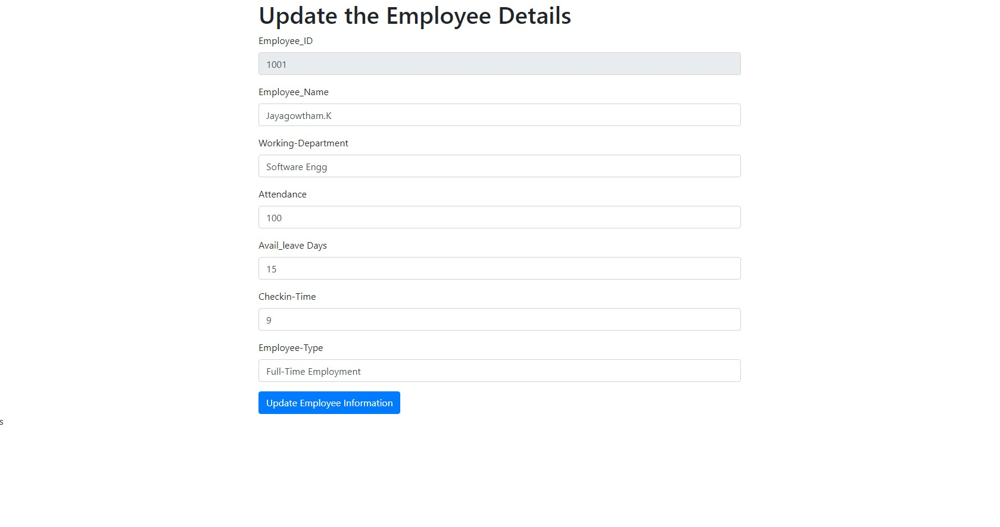

# Bike Showroom Management System

- Welcome to the Bike Showroom Management System! This Spring Boot application is designed to facilitate the management of bike and employee information within a showroom setting. Below you will find a brief overview of the features and functionalities of this application. with SQL to filter the bikes according with the name and price of them and search them with name.

### CRUD Operations for Bike Information:

- Create: Add new bikes to the showroom inventory.
- Read: Retrieve details of existing bikes.
- Update: Modify information of existing bikes.
- Delete: Remove bikes from the showroom inventory.

### CRUD Operations for Employee Information:

- Create: Add new employees to the showroom.
- Read: Retrieve details of existing employees.
- Update: Modify information of existing employees.
- Delete: Remove employees from the showroom records.

### RESTful API Endpoints:

Utilize REST controllers for seamless interaction with the application. These endpoints allow external applications, such as Postman, to perform CRUD operations on bike information.
Logging Aspect:

- Integrated logging aspect to monitor the status and activities within the application. This feature enhances transparency and aids in troubleshooting.

## Result Images of Bike Showroom:

### Bike Showroom Main page:

### Bike Showroom - BikeRecords

### Bike Showroom - BikeRecords Addpage

### Bike Showroom - BikeRecords Editpage

### Bike Showroom - Employee Records

### Bike Showroom - Employee Records Add page

### Bike Showroom - Employee Records Edit page

